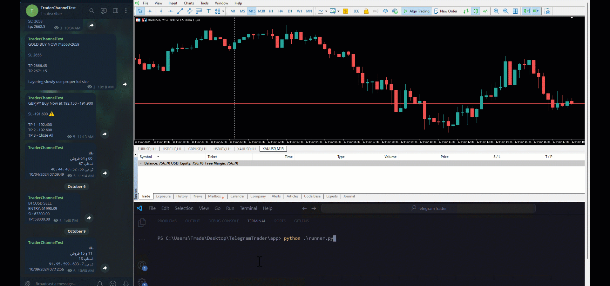

## Demo


// ... existing code ...

# Features

- **MetaTrader 5 Integration**: Connects to MetaTrader 5 terminals for automated trading operations.
- **Symbol Management**: Validates and manages trading symbols, including visibility and selection in MarketWatch.
- **Account Login**: Handles secure login to MetaTrader accounts with error handling.
- **Position Management**:
  - Retrieve open positions and pending orders.
  - Close full or half of a position.
  - Save partial profits based on customizable strategies.
  - Automatically close positions or remove pending orders.
- **Order Management**:
  - Determine order type (market, limit, stop) based on price and strategy.
  - Place, modify, or remove pending orders.
- **Stop Loss & Take Profit**:
  - Update stop loss for both open positions and pending orders.
  - Validate and adjust take profit levels for different trading scenarios.
- **Utility Functions**:
  - Retrieve server time from MetaTrader.
  - Validate and adjust price levels for various trading actions.
  - Support for custom strategies and advanced order logic.
- **Logging & Error Handling**: Uses structured logging for all trading actions and error conditions.

# Project Setup Guide

Follow these steps to set up and run the project.

## 1. Configure Environment Variables
- Select and configure your environment in the `.env` file.

## 2. Set Application Settings
- Update the configuration files located in the `config` folder. Ensure that all required settings are defined in the appropriate `.json` files.

## 3. Run the Application
```bash
cd app && python runner.py
```
### Or 
1. download the [latest Release](https://github.com/ebrahimkhodadadi/TelegramTrader/releases) 
2. create [settings.json](https://github.com/ebrahimkhodadadi/TelegramTrader/blob/master/docs/Config.md) next to it

## Requirements Installation
Before running the application, install the required dependencies:

```bash
# Install necessary Python packages
pip install python-configuration
pip install setuptools
pip install -r requirements.txt
```

---

# Running Tests

To run the unit tests, use the following command:

```bash
python -m unittest .\tests\AnalyzerTest.py
```

---

## Documentation

For more detailed information about the project, please refer to the documentation located in the `/docs` folder.
